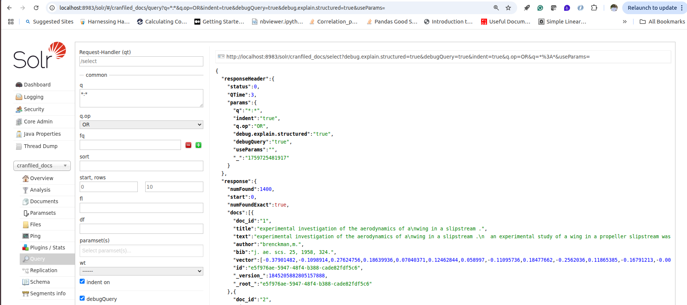

# Indexing Cranfield Documents into Solr

This directory contains `index-docs.py`, a script to:

- Create a Solr core for the Cranfield dataset
- Define a schema with text and dense vector fields
- Generate BERT embeddings for each document and index them into Solr

## Prerequisites

- Poetry for dependency management
- A running Solr instance accessible at `http://localhost:8983/solr`

## Setup

1. Navigate to the `1-indexdocs` directory:
   ```bash
   cd 1-indexdocs
   ```
2. Install dependencies with Poetry (if not already done):
   ```bash
   poetry install --no-root 
   ```

## Installing Additional Dependencies

If you haven’t already, add required packages via Poetry:

```bash
poetry add requests torch ir-datasets transformers
```

## Usage

Run the script inside the Poetry environment:

```bash
poetry run python index-docs.py
```

By default, the script will:
1. Create a core named `cranfiled_docs` (config set `_default`)
2. Define fields including a `knn_vector` for BERT embeddings
3. Load Cranfield documents from `ir_datasets`
4. Generate mean-pooled BERT embeddings
5. Index documents with their vector representations into Solr

## Configuration

- To change the Solr URL or core name, edit the `solr_url` and `core_name` parameters in `index-docs.py`.

## Troubleshooting

- Ensure Solr is running and accessible.
- Verify that the required Python packages are installed in the Poetry environment.
- Check logs for HTTP errors when creating cores or indexing documents.


If the documents are indexed successfully, you should see output like this 
From the script:

```

=== Creating Core ===
✓ Core 'cranfiled_docs' created successfully

=== Defining Schema ===
✓ Field type 'vector' configured with HNSW indexing
✓ Added field: doc_id
✓ Added field: title
✓ Added field: text
✓ Added field: author
✓ Added field: bib
✓ Added field: vector

=== Indexing Documents ===
✓ Indexed 1400 documents successfully

All done!
``` 
from the Solr UI




---

Happy indexing!